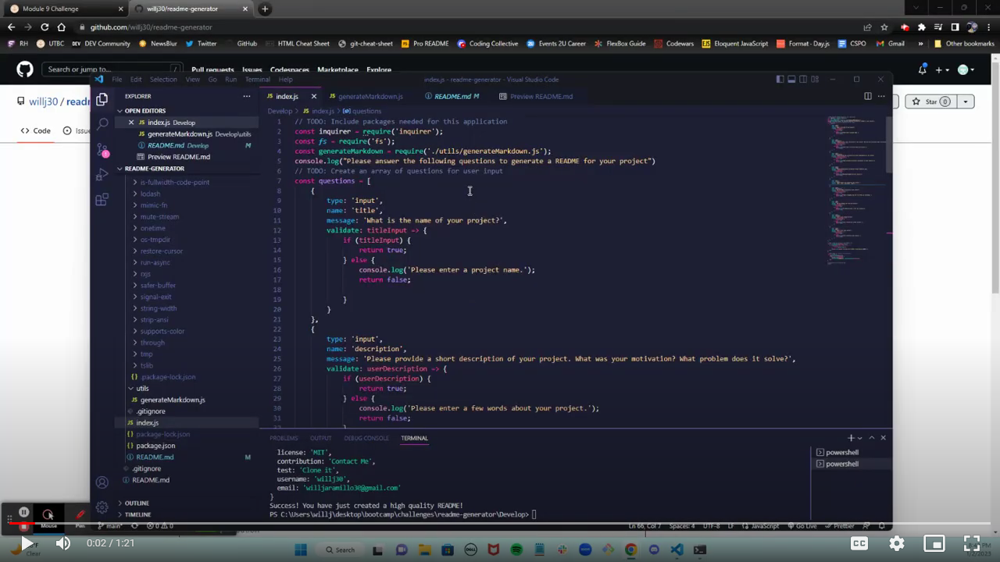

# Will's README Generator
  
  
 

  ## Description
  I created this project to allow for users to create their own README for their projects within the command line using node js by answering simple prompts. This makes it easier to build a basic README for projects.
  
  ## Table of Contents
  * [Description](#description)
  * [Installation](#installation)
  * [Usage](#usage)
  * [License](#license)
  * [Contribution](#contribution)
  * [Tests](#tests)
  * [Questions](#questions)
  

  ## Installation
  The user will need to download the inquirer package using the npm install command in node js. 
  
  ## Usage
  Once the required dependencies are installed, open the integrated terminal and run the "node index.js" command. This will display prompts and the README file will be created after answering all of them.

  Demonstration:

 
 

  ## License
  The license this project is under is MIT. For more information, please click the link below:

  https://opensource.org/licenses/MIT
  
  ## Contribution
  Feel free to create a fork or reach out to me with suggestions.
  
  ## Tests
  Users can test this project by cloning my repository and seeing for themselves how this works.
  
  ## Questions
  Any Questions? You can email me at willjaramillo30@gmail.com
  Or, reach out to me on GitHub at https://github/willj30
